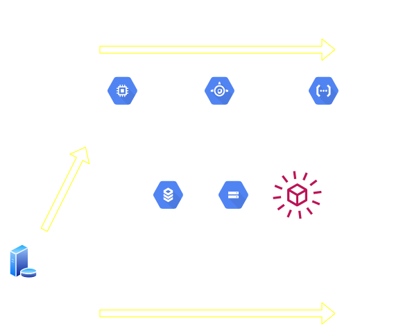

## FaaS
### 11.10.2020    

---

Function as a Serviceの略です。

---

サーバレスでプログラム（AP）を実行できるサービスです。

---

以前、「リフトアンドシフト」というワードを説明しましたが、
その最終形（現時点では）と言われています。

>>>

---

### PaaSとの違い
- PaaSはリソースを確保しますが、サーバレスでは確保しません。 
`→リソース確保時間に対して費用が発生しない` 
`→実行回数や時間に対して費用が発生する。`

---

### 各社のサービス
|    |  サービス名  |
| ---- | ---- |
|  AWS  |  Lambda  |
|  Azure  |  Azure function  |
| GCP | Cloud function |

---

### 便利そうに思える反面、サービスにおける制約も多いです。
- 対応するランタイムがベンダ次第
- 都度、コンテナで起動されるため開始から終了までのレスポンスが長い
- 起動時間に制限がある（10~15min）
- メモリリソースに制限がある。(最大2~3GB)

---

### 使いどころ(私の主観)
- 小規模なイベント駆動処理
- 新規サービスのPOC
- クラウドサービス間のトリガー処理や後処理

---

### 使わない方がいい、気を付けるケース
- 大量データのバッチ処理
- 低レイテンシなレスポンスが求められるサービスや機能
- RDBMSとの接続時は常時コネクションができないので設計に注意
- コンテナなので、ステートレスに実装すること

